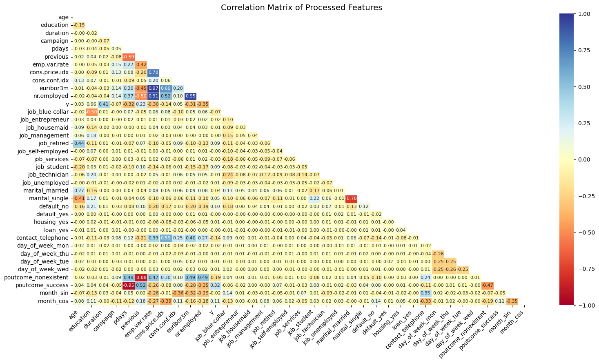
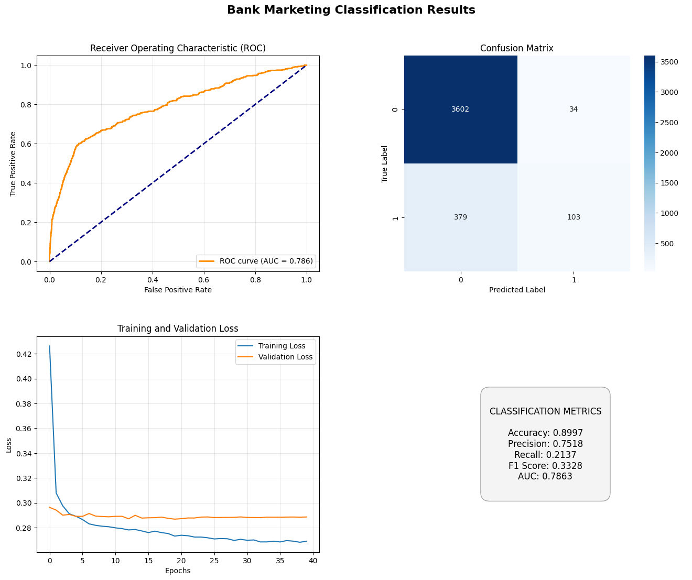
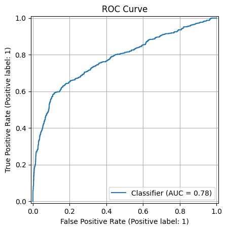

# Bank Term Deposit Subscription Prediction: Portfolio Project

**Project Goal:** Predict which bank customers will subscribe to a term deposit using advanced machine learning, with a focus on real-world business impact and model interpretability.

---

## 1. Data Overview & Preprocessing

**Dataset:** 41,188 samples, 21 features (demographics, financials, campaign data). Target: `y` (term deposit subscription).

**Sample Data:**
```csv
"age";"job";"marital";"education";"default";"housing";"loan";"contact";"month";"day_of_week";"duration";"campaign";"pdays";"previous";"poutcome";"emp.var.rate";"cons.price.idx";"cons.conf.idx";"euribor3m";"nr.employed";"y"
56;"housemaid";"married";"basic.4y";"no";"no";"no";"telephone";"may";"mon";261;1;999;0;"nonexistent";1.1;93.994;-36.4;4.857;5191;"no"
57;"services";"married";"high.school";"unknown";"no";"no";"telephone";"may";"mon";149;1;999;0;"nonexistent";1.1;93.994;-36.4;4.857;5191;"no"
... (see full dataset)
```

**Cleaning Steps:**
- Removed duplicates
- Replaced "unknown" in categorical columns with mode
- Encoded categorical features (one-hot, cyclic for months)

**Feature Table:**
| Feature | Description |
|---------|-------------|
| age | Client age |
| job | Job type |
| marital | Marital status |
| ... | ... |
| y | Subscribed? (target) |

---

## 2. Exploratory Data Analysis

**Numerical Features:**


**Categorical Features:**


**Correlation Matrix:**


**Feature Selection:**
- Dropped highly correlated/redundant features (e.g., `euribor3m`, `emp.var.rate`, `previous`, `pdays`...etc)

---

## 3. Feature Engineering

- Standardized/normalized numerical features
- One-hot/cyclic encoding for categoricals
- Feature importance via Random Forest

---

## 4. Model Development: Artificial Neural Network (ANN)

**Why ANN?**
Artificial Neural Networks (ANNs) are powerful for capturing complex, non-linear relationships in high-dimensional data. Here, an ANN outperformed tree-based models in AUC and generalization.

**Architecture:**
```python
model = Sequential([
    Dense(128, activation='relu', input_shape=(X_train.shape[1],)),
    BatchNormalization(),
    Dropout(0.3),
    Dense(64, activation='relu'),
    BatchNormalization(),
    Dropout(0.2),
    Dense(32, activation='relu'),
    BatchNormalization(),
    Dropout(0.2),
    Dense(1, activation='sigmoid')
])
```

**Training:**
- Early stopping and learning rate reduction to prevent overfitting
- 150 epochs, batch size 64, validation split

**Training Curves:**


---

## 5. Model Validation & Optimization

**Cross-Validation:**
5-fold cross-validation for robust accuracy estimation:
```python
# Set up cross-validation
kfold = KFold(n_splits=5, shuffle=True, random_state=42)
cv_scores = []

# Manual cross-validation loop
for train_idx, val_idx in kfold.split(X_scaled):
    # Split data
    X_train_cv, X_val_cv = X_scaled.iloc[train_idx], X_scaled.iloc[val_idx]
    y_train_cv, y_val_cv = y.iloc[train_idx], y.iloc[val_idx]
    
    # Build model
    model = tf.keras.Sequential([
        tf.keras.layers.Dense(128, activation='relu', input_shape=(X_scaled.shape[1],)),
        tf.keras.layers.BatchNormalization(),
        tf.keras.layers.Dropout(0.3),
        tf.keras.layers.Dense(64, activation='relu'),
        tf.keras.layers.BatchNormalization(),
        tf.keras.layers.Dropout(0.2),
        tf.keras.layers.Dense(32, activation='relu'),
        tf.keras.layers.BatchNormalization(),
        tf.keras.layers.Dropout(0.2),
        tf.keras.layers.Dense(1, activation='sigmoid')
    ])
    
    # Compile
    model.compile(
        optimizer=tf.keras.optimizers.Adam(0.001),
        loss='binary_crossentropy',
        metrics=['accuracy']
    )
    
    # Train
    early_stopping = EarlyStopping(monitor='val_loss', patience=10, restore_best_weights=True)
    history = model.fit(
        X_train_cv, y_train_cv,
        epochs=50,
        batch_size=64,
        validation_data=(X_val_cv, y_val_cv),
        callbacks=[early_stopping],
        verbose=0
    )
    
    # Evaluate
    _, accuracy = model.evaluate(X_val_cv, y_val_cv, verbose=0)
    cv_scores.append(accuracy)
```
**Result:** CV Accuracy ≈ 0.8992 (±0.0022)

**Hyperparameter Tuning:**
Grid search over batch size, learning rate, dropout, optimizer. 
Best: batch_size=32, lr=0.001, dropout=0.2, optimizer='rmsprop'.
```
Params: {'batch_size': 32, 'learning_rate': 0.001, 'dropout_rate': 0.2, 'optimizer': 'adam', 'accuracy': 0.9023476839065552}
/opt/anaconda3/lib/python3.12/site-packages/keras/src/layers/core/dense.py:87: UserWarning: Do not pass an `input_shape`/`input_dim` argument to a layer. When using Sequential models, prefer using an `Input(shape)` object as the first layer in the model instead.
  super().__init__(activity_regularizer=activity_regularizer, **kwargs)
...

Best parameters: {'batch_size': 32, 'learning_rate': 0.001, 'dropout_rate': 0.2, 'optimizer': 'rmsprop', 'accuracy': 0.9024488925933838}
```
Final Best parameters: batch_size=32, lr=0.001, dropout=0.2, optimizer='rmsprop'.

---

## 6. Final Evaluation & Results

**Test Set Performance:**
- Final Test Accuracy: 0.8961
- ROC AUC Score: 0.7777

**Classification Report:**
               precision    recall  f1-score   support

           0       0.90      0.99      0.94      3636
           1       0.76      0.16      0.27       482

    accuracy                           0.90      4118
   macro avg       0.83      0.58      0.61      4118
weighted avg       0.88      0.90      0.87      4118

**Confusion Matrix:**
 [[3611   25]
 [ 403   79]]


**ROC Curve:**


---

## 7. Insights & Recommendations

**Key Insights:**
- Model is highly precise but recall for subscribers is low (class imbalance)
- ANN is robust for complex, high-dimensional data

**Business Recommendations:**
- Use class weighting or threshold tuning to improve recall
- Consider ensemble with tree-based models for further gains

---

## Conclusion

This project demonstrates the power of ANNs for bank marketing prediction, with a rigorous workflow from cleaning to hyperparameter tuning. The approach is generalizable to other imbalanced, high-dimensional business problems.

---

**Citation:**  
Moro et al., 2014. [A Data-Driven Approach to Predict Bank Telemarketing Success](http://dx.doi.org/10.1016/j.dss.2014.03.001).